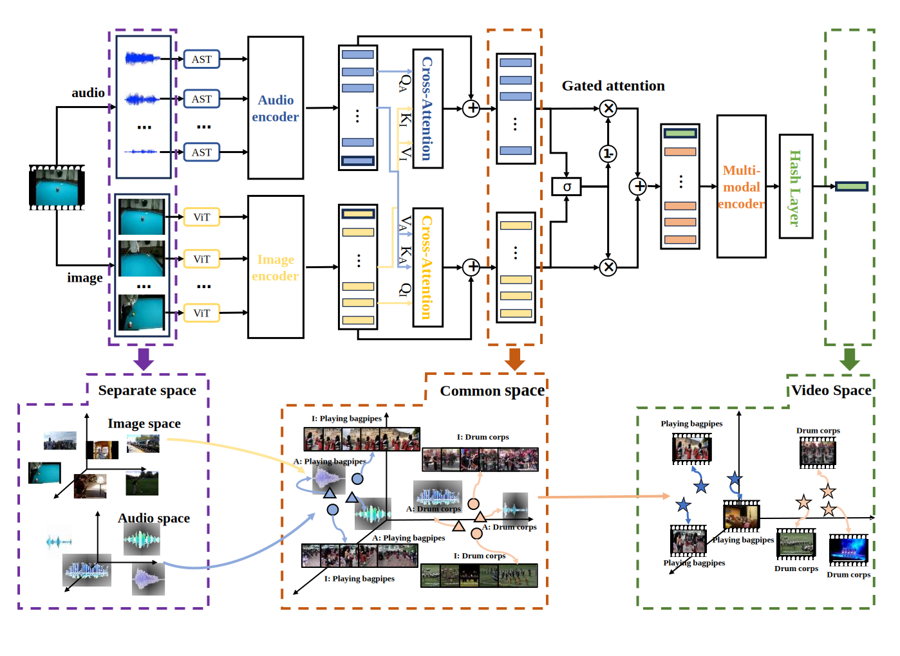

# AVHash
This repository is the PyTorch implementation of ACM MM 2024 (CCF A) paper: "AVHash:Joint Audio-Visual Hashing for Video Retrieval".
<p align="center">
  
</p>

We propose a tri-level Transformer-based audio-visual hashing technique for video retrieval, named AVHash. It first processes audio and visual signals separately using pre-trained AST and ViT large models, and then projects temporal audio and key frames into a shared latent semantic space using a Transformer encoder. Subsequently, a gated attention mechanism is designed to fuse the paired audio-visual signals in the video, followed by another Transformer encoder leading to the final video representation. 

Experimental results show that AVHash significantly outperforms existing video hashing methods in video retrieval tasks. Furthermore, ablation studies reveal that while video hashing based solely on visual signals achieves commendable mAP scores, the incorporation of audio signals can further boost its performance for video retrieval.

## Catalogue

- [Getting Started](#getting-started)
- [Data Processing](#data-processing)
- [Train](#train)
- [Test](#test)
  
## Getting Started
1. Clone this repository:
```
git clone https://AVHash.git
cd AVHash
```
2. Create a conda environment and install the dependencies:
```
conda create -n avhash python=3.10
conda activate avhash
pip install torch==2.1.0 torchvision==0.16.0 torchaudio==2.1.0 --index-url https://download.pytorch.org/whl/cu121
pip install -r requirements.txt
```

## Data Processing
1. Download Datasets
   Datasets of FCVID and ActivityNet are kindly uploaded by the authors. You can download them from the following links.
   
	| *Dataset*   | *Link*                                                  |
	| ----------- | ------------------------------------------------------- |
	| FCVID       | [Link](https://pan.baidu.com/s/1xlViGrhOQ8Jrwgn0UEtukg?pwd=snw3) |
	| ActivityNet | [Link](https://pan.baidu.com/s/1d9B8p-1oVNRy88Xgo5somw?pwd=6ji8) |

2. Feauture Extraction

    2.1 **Video Processing**:
    - For each video, uniformly extract 25 frames.
    - Uniformly divide the audio into 25 segments.

    2.2 **Feature Extraction**:

    - For each frame, use the [CLIP](https://github.com/openai/CLIP) model to generate a 768-dimensional vector.
    - For each audio segment, use the [AST](https://github.com/YuanGongND/ast) model to generate a 768-dimensional vector.

    2.3 **Data Storage**:
    - Each video has `(25, 768)` image features and `(25, 768)` audio features.
    
    - Store the features of each video in one HDF5 file.
    
    - Store all audio features in another HDF5 file.
  
      The structure of the HDF5 file storing video features is as follows:
      ```
      ActivityNet_image.h5
      ├── v_---9CpRcKoU
      │ └── vectors
      │ └── Type: float32
      ├── v_--0edUL8zmA
      │ └── vectors
      │ ├── Shape: (25, 768)
      │ └── Type: float32
      ├── v_--1DO2V4K74
      │ └── vectors
      │ ├── Shape: (25, 768)
      │ └── .....
      └── .....
      ```
      
      The structure of the HDF5 file storing audio features is as follows:
       ```
      ActivityNet_audio.h5
      ├── v_---9CpRcKoU
      │ └── vectors
      │ └── Type: float32
      ├── v_--0edUL8zmA
      │ └── vectors
      │ ├── Shape: (25, 768)
      │ └── Type: float32
      ├── v_--1DO2V4K74
      │ └── vectors
      │ ├── Shape: (25, 768)
      │ └── .....
      └── .....
      ```

	
      
      In above structure:
      - Each video's ID serves as the top-level group name.
      - Each group contains a dataset named vectors.
      - The vectors dataset contains the image or audio features of the video, with a shape of (25, 768) and a type of float32.
​
3. Dataset Splitting
   
   Split the dataset into training, validation, and test sets evenly based on categories. The file IDs for different data splits are stored in `train.txt`, `test.txt`, and `val.txt` files respectively.
   
   **ActivityNet** contents are as follows, with each line including: videoname, video frame count, category.
   ```
   v_JDg--pjY5gg,3153,10
   v_DFAodsf1dWk,6943,10,10,10
   v_J__1J4MmH4w,3370,10,10,10,10
   ...
   ```

	 **FCVID** contents are as follows, with each line including: videoname, category.
   ```
   --0K_j-zexM,76
   --1DKnUmLNQ,163
   --45hTBwKRI,117
   ...
   ```
   
5. Configure the **Anet.json** and **fcvid.json** file in ./Json/
   ```
   {
   "dataset":  dataset ("actnet" or "fcvid")
   "data_path": path to the image frames floder,
   "num_class":  dataset classes, 200(actnet) or 239(fcivd)
   "train_list": "path to the train set file",
   "val_list": "path to the validation set file",
   "test_list": "path to the test set file",
   "retrieval_list": "path to the databese set (train set) file"
   }
   ```
   


  ## Train

  To train AVHash on FCVID:

  ```bash
  python run.py --dataset "path to fcvid.json" --hashcode_size 64 --lr le-4 --max_iter 100 --device cuda:0 --batch_size 128 --result_log_dir " " --result_weight_dir " "
  ```

  To train AVHash on ActivityNet:

  ```bash
  python run.py --dataset "path to Anet.json" --hashcode_size 64 --lr le-4 --max_iter 100 --device cuda:0 --batch_size 128 --result_log_dir " " --result_weight_dir " "
  ```

  Options:

  - `--dataset`: path to Anet.json or fcvid.json
  - `--hashcode_size`: code length of hash.
  - `--lr`: learning rate.
  - `--max_iter`: training epochs.
  - `--device`: choose the gpu to use.
  - `--batch_size`: the number of videos in a batch.
  - `--result_log_dir`: path to save log
  - `--result_weight_dir`: path to save weight


  ## Test
  To test AVHash on FCVID:
  ```bash
  python test.py --dataset "path to fcvid.json" --hashcode_size 64 --device cuda:0 --batch_size 128 --weight_path " "
  ```
  To test AVHash on ActivityNet: 
  ```bash
  python test.py --dataset "path to Anet.json" --hashcode_size 64 --device cuda:0 --batch_size 128 --weight_path " "
  ```

  Options:

  - `--dataset`: path to Anet.json or fcvid.json
  - `--hashcode_size`: code length of hash.
  - `--device`: choose the gpu to use.
  - `--weight_path`: the path to the weights to be loaded.
  - `--batch_size`: the number of videos in a batch.
  - `--weight_path`: the path to the weights to be loaded.

 
 ## Citation

If you find this repository useful, please consider citing our work:

```
Yuxiang Zhou, Zhe Sun, Rui Liu, Yong Chen (Corresponding), Dell Zhang. AVHash: Joint Audio-Visual Hashing for Video Retrieval. ACM Multimedia 2024.
```

 ## Contact

For questions and further information about this research, please don't hesitate to contact us:

| Name | Email |
|------|-------|
| Yuxiang Zhou | yuxiang.zhou@bupt.edu.cn |
| Yong Chen | yong.chen@bupt.edu.cn |

We welcome collaboration opportunities and are happy to provide additional details about our work.
